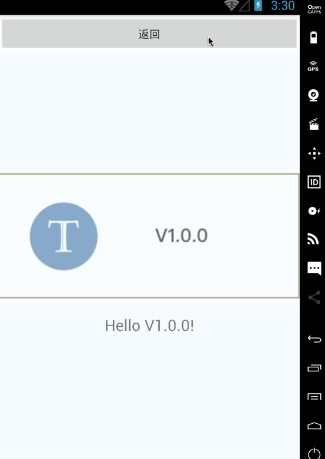

# dynamic-code-rn
根据用户选择执行不同版业务代码的Demo（ReactNative版）。


# iOS Screenshot


# Android Screenshot



# Usage

* 启动`业务代码`下载服务：

```shell
$ git clone https://github.com/nanjingboy/dynamic-code-rn.git
$ cd dynamic-code-rn
$ yarn install
$ yarn res-server
```

* 用 `XCode` 或 `Android Studio` 打开 `ios` 或 `android` 目录，按照传统方式编译运行即可。

